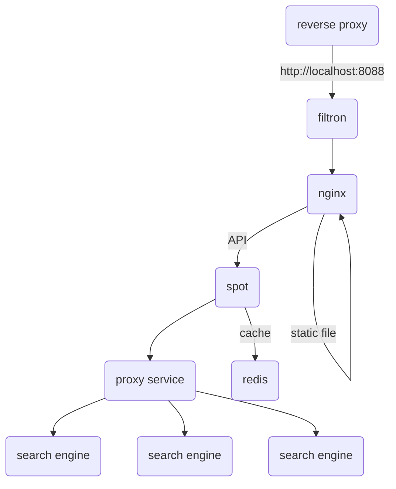

# spot for [/e/](https://e.foundation)


A privacy-respecting, hackable [metasearch engine](https://en.wikipedia.org/wiki/Metasearch_engine).

Spot was forked from searx: read [documentation](https://asciimoo.github.io/searx) and the [wiki](https://github.com/asciimoo/searx/wiki) for more information.

## Changes between Spot and Searx

* /e/ theme
* redis cache on http requests (TTL 1 day)
* docker packaging thinking to be production ready

## Architecture

6 services are used for production:

* [filtron](https://github.com/asciimoo/filtron) as reverse HTTP proxy to filter requests by different rules.
* [nginx](https://www.nginx.com/) as http server to serve static files.
* Spot the meta search engine.
* [redis](https://redis.io/) as memory storage to cache http requests





## Conversion Engine

Spot uses [mathjs](https://mathjs.org/index.html) to perform arithmetic operations on the query. It also supports conversion of units
and can perform arithmetic operations on units. Supported units and operations can be found [here](https://mathjs.org/docs/datatypes/units.html#reference)


Spot also supports currency conversion though [xe](https://xe.com/) API.

## Getting Started

You can run spot with docker-compose. First of all you have to install
docker and docker-compose on your host, then follow instructions
below to run spot for production or local environment.

### Like production


Run the docker-compose to start the project

```
docker-compose up -d
```

Then go to http://localhost:8088.

### For developer

You can only run spot, with a python command inside a docker container which
contains all dependencies.

```
docker run -it --rm -v $(pwd):/ws -w /ws -e SEARX_UI_DEFAULT_THEME=etheme -p 8088:80 registry.gitlab.e.foundation/e/infra/spot/env bash
PYTHONPATH=$(pwd) SEARX_DEBUG=1 python -X dev searx/webapp.py
```
